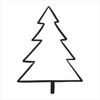

# elliot

## This is a secondary title

### third type of title

```Python
this a code box

def function():
    some function
    return $
```

some sample text

*italic*

**bold**

***italic and bold***

****
# Images

<p align='center'> </p>

<p align='right'> </p>

<p align='left'> </p>

